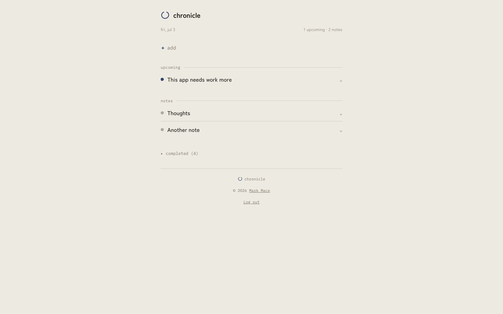
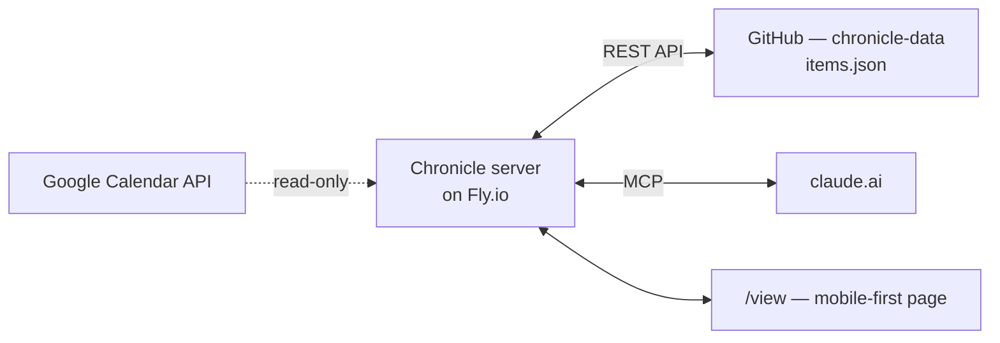

# Chronicle

Notes, reminders, and calendar events as one thing: an *item*, distinguished only by
its temporal shape. Built for Claude to work on directly, not bolted onto afterward.

## Why

Reminders, calendar events, and notes are the same underlying object — an item with
content — differentiated only by time:

- **Event** — fixed start, fixed end
- **Reminder** — fixed start (or none, for "anytime"), open end until completed
- **Note** — no temporal constraint at all

Apple's Notes/Reminders/Calendar are three siloed apps with weak API access, which
makes it hard for an agent to reason across "what's on my plate" the way you can by
glancing at all three. Chronicle models time as a property of one item type instead —
one coherent surface for Claude to read, write, and reason over.

This is the *skateboard*: the smallest end-to-end version that proves the loop of
Claude and me working on the same items together. Single-user, MCP as the primary
interface, plus a mobile-first page for add/edit/complete/delete. No calendar view,
no native app yet — those are car parts for later, though the JSON API underneath
is built with them in mind.

## Screenshots

|  |  |
|---|---|
|  |  |
|  |  |



Regenerate these against your own dev server after UI changes with:

```bash
uv run python scripts/screenshot.py
```

(Requires `.dev.env` set up per **Local development** below, and Google Chrome
installed at the standard macOS path.) This drives Chrome over the DevTools
Protocol directly rather than trusting the `--window-size` CLI flag — on at
least this machine's Chrome build, that flag is silently floored around
500px in headless screenshot mode, so a requested mobile width still laid
out (and got cropped from) a desktop-width page.

## How it works



All items live as one JSON array (`items.json`) in a private GitHub repo — free
version history, zero database to run, $0/month on Fly's free tier. Every write is a
git commit.

### MCP tools

| Tool | What it does |
|---|---|
| `create_item(title, content?, tags?, start?, end?)` | Create a note/reminder/event — the shape follows from which time fields you set |
| `list_items(tag?, start_after?, start_before?, include_completed?)` | List item summaries, filtered |
| `get_item(id)` | Full item including content |
| `update_item(id, ...)` | Partial patch; `clear_start`/`clear_end` to remove time fields |
| `complete_item(id)` / `uncomplete_item(id)` | Toggle done state, idempotent |
| `delete_item(id)` | Destructive — Claude always confirms first |

`list_items`/`get_item` also surface read-only Google Calendar events when configured
(see below) — `source: "google_calendar"` in the summary, `gcal:`-prefixed id. Mutating
one of those returns a clean error instead of a 404/500.

### The `/view` page

`GET /view/<MCP_TOKEN>` — a mobile-first page grouping items into Upcoming / Notes /
Completed. Add is collapsed behind a small "+" bar by default; tapping an item's
title opens a dedicated edit screen (title/content/tags/start/end, plus delete).
No build tooling, no JS framework — plain forms POSTing back to the same server,
with a little inline JS just for timezone conversion on datetime fields. Add it to
your iPhone home screen (Share → Add to Home Screen) for an app-like, chrome-free
view.

### JSON REST API

`/api/<MCP_TOKEN>/items` (GET/POST), `/api/<MCP_TOKEN>/items/<id>` (GET/PATCH/DELETE),
plus `/complete` and `/uncomplete` POST endpoints — the same operations as the MCP
tools and the HTML forms, as JSON. Not consumed by the current page (which still
uses plain form POSTs), but there so a future richer web app or native app has a
stable contract to build on without another rewrite of the business logic — which
all three surfaces (MCP, HTML forms, JSON API) share via `items_service.py`.

### Google Calendar (optional, read-only)

If configured, events from your Google Calendars are merged into the same
Upcoming list, MCP `list_items`/`get_item`, and JSON API — live at read time via
`google_calendar_service.py`, never written to `items.json`. No two-way sync: you
can't complete, edit, or delete a calendar-sourced item from Chronicle (it'll
tell you to use Google Calendar instead). Entirely optional — everything else
works exactly the same without it. Setup: see step 6 below.

Env vars: `GOOGLE_CLIENT_ID`, `GOOGLE_CLIENT_SECRET`, `GOOGLE_CALENDAR_REFRESH_TOKEN`,
`GOOGLE_CALENDAR_IDS` (comma-separated calendar ids to pull from).

---

## Setup

You'll need a GitHub account and [flyctl](https://fly.io/docs/hands-on/install-flyctl/).

### 1. Make a data repo

```bash
gh repo create youruser/chronicle-data --private --add-readme
```

### 2. Make a GitHub PAT

github.com/settings/tokens → a fine-grained token scoped to `chronicle-data` with
Contents read/write is enough (a classic token with `repo` scope also works).

### 3. Deploy the server

```bash
git clone https://github.com/youruser/chronicle
cd chronicle
fly launch          # accept defaults, decline deploy-now
# If fly launch regenerates fly.toml, keep internal_port = 8080 — the Dockerfile hardcodes 8080

fly secrets set \
  MCP_TOKEN=$(openssl rand -hex 32) \
  VIEW_PASSWORD=some-password-you-choose \
  GITHUB_TOKEN=ghp_your_pat_here \
  GITHUB_REPO=youruser/chronicle-data

fly deploy
```

Note the `MCP_TOKEN` — you'll need it for the connector URL.

### 4. Connect Claude

claude.ai → **Settings → Connectors → Add custom connector**

URL: `https://<your-app>.fly.dev/mcp/<your-MCP_TOKEN>`

**Security note:** the token is in the URL path, so it can appear in server/proxy
access logs. Deliberate simplicity tradeoff for a personal tool. Rotate with
`fly secrets set MCP_TOKEN=$(openssl rand -hex 32)` if it leaks.

Ask Claude "list my Chronicle items" — should come back empty on a fresh repo.

### 5. Log in to the web page

Visit `https://<your-app>.fly.dev/` and enter `VIEW_PASSWORD`. A cookie remembers
you for ~400 days (Chrome's max), so this is normally a one-time thing per device
— log out via the link in the page footer if you ever need to re-auth. The old
`/view/<MCP_TOKEN>` URL still works directly too, session or not.

Bookmark the bare domain (`https://<your-app>.fly.dev/`) — that's the friendly
entry point now.

### 6. (Optional) Connect Google Calendar

1. In [Google Cloud Console](https://console.cloud.google.com), enable the
   **Google Calendar API**, then set up an **OAuth consent screen** (User type
   External, Publishing status Testing, add your own email as a test user — no
   Google review needed for personal use), then create an **OAuth client ID**
   of type **Desktop app**. Note the client ID/secret.
2. `export GOOGLE_CLIENT_ID=... GOOGLE_CLIENT_SECRET=...` then
   `uv run python scripts/google_calendar_auth.py` — opens your browser for
   consent, then prints your calendars and the `fly secrets set` command to run.
3. Run the printed command (fill in which calendar ids you want), then
   `fly deploy`.

## Local development

```bash
uv sync
cp .dev.env.example .dev.env   # fill in MCP_TOKEN, GITHUB_TOKEN, GITHUB_REPO
set -a && source .dev.env && set +a
uv run uvicorn main:app --reload --port 8080
```

`uv run python scripts/smoke_test.py` exercises the storage layer directly against
the real data repo (creates a note/reminder/event tagged `smoke-test`, checks
filtering, completes one, then deletes everything it created).

The four `GOOGLE_*` vars (see "Connect Google Calendar" above) can go in `.dev.env`
too, to test the calendar merge locally — the app runs fine without them, calendar
events just don't appear.

## File layout

```
main.py                     — FastAPI app: MCP mount, /healthz, /view + /view/.../edit pages, JSON API
mcp_server.py                — the 7 MCP tools (thin wrappers over items_service)
items_service.py             — shared create/list/get/update/complete/delete logic
google_calendar_service.py   — read-only Google Calendar fetch + merge, no-ops if unconfigured
views_service.py             — composable-groups + persisted default view mode (views.json)
models.py                    — item schema, validation, derived kind
storage.py                   — items.json read/write, retry-once-on-conflict mutation helper
github_store.py               — thin GitHub Contents API client (generic file read/write)
auth.py                       — constant-time token comparison
templates/items.html          — the canonical list view
templates/custom_view.html    — the composable-groups view
templates/edit_item.html      — the single-item edit screen
templates/login.html          — password login screen
templates/_mark.html          — the ensō ink-mark, included wherever the logo appears
static/style.css              — shared styling for all pages
static/favicon.svg            — browser tab icon (same mark)
scripts/smoke_test.py         — dev-only, exercises storage/models against the real repo
scripts/screenshot.py         — regenerates docs/screenshots/ from a local dev server
scripts/google_calendar_auth.py — one-time local OAuth flow, see "Connect Google Calendar" above
Dockerfile
fly.toml
```

## Cost

Fly.io's free tier covers this — 256MB RAM, shared CPU, auto-stops when idle. GitHub
API calls are well under the 5000/hour limit. $0/month for personal use.

## License

MIT — do whatever you want with it.
